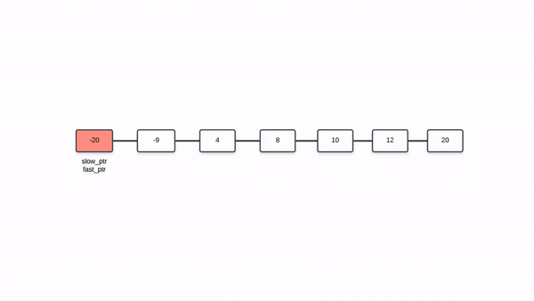

109. Convert Sorted List to Binary Search Tree

Given a singly linked list where elements are sorted in ascending order, convert it to a height balanced BST.

For this problem, a height-balanced binary tree is defined as a binary tree in which the depth of the two subtrees of every node never differ by more than 1.

Example:
```
Given the sorted linked list: [-10,-3,0,5,9],

One possible answer is: [0,-3,9,-10,null,5], which represents the following height balanced BST:

      0
     / \
   -3   9
   /   /
 -10  5
```

# Solution

## Approach 1: Recursion
**Intuition**

The important condition that we have to adhere to in this problem is that we have to create a height balanced binary search tree using the set of nodes given to us in the form of a linked list. The good thing is that the nodes in the linked list are sorted in ascending order.

As we know, a binary search tree is essentially a rooted binary tree with a very special property or relationship amongst its nodes. For a given node of the binary search tree, it's value must be \ge≥ the value of all the nodes in the left subtree and \le≤ the value of all the nodes in the right subtree. Since a binary tree has a recursive substructure, so does a BST i.e. all the subtrees are binary search trees in themselves.

The main idea in this approach and the next is that:
> the middle element of the given list would form the root of the binary search tree. All the elements to the left of the middle element would form the left subtree recursively. Similarly, all the elements to the right of the middle element will form the right subtree of the binary search tree. This would ensure the height balance required in the resulting binary search tree.

**Algorithm**

1. Since we are given a linked list and not an array, we don't really have access to the elements of the list using indexes. We want to know the middle element of the linked list.
1. We can use the two pointer approach for finding out the middle element of a linked list. Essentially, we have two pointers called slow_ptr and fast_ptr. The slow_ptr moves one node at a time whereas the fast_ptr moves two nodes at a time. By the time the fast_ptr reaches the end of the linked list, the slow_ptr would have reached the middle element of the linked list. For an even sized list, any of the two middle elements can act as the root of the BST.
1. Once we have the middle element of the linked list, we disconnect the portion of the list to the left of the middle element. The way we do this is by keeping a prev_ptr as well which points to one node before the slow_ptr i.e. prev_ptr.next = slow_ptr. For disconnecting the left portion we simply do prev_ptr.next = None
1. We only need to pass the head of the linked list to the function that converts it to a height balances BST. So, we recurse on the left half of the linked list by passing the original head of the list and on the right half by passing slow_ptr.next as the head.

Let's look at this algorithm in action on a sample linked list.



```python
# Definition for singly-linked list.
# class ListNode:
#     def __init__(self, x):
#         self.val = x
#         self.next = None

# Definition for a binary tree node.
# class TreeNode:
#     def __init__(self, x):
#         self.val = x
#         self.left = None
#         self.right = None

class Solution:

    def findMiddle(self, head):

        # The pointer used to disconnect the left half from the mid node.
        prevPtr = None
        slowPtr = head
        fastPtr = head

        # Iterate until fastPr doesn't reach the end of the linked list.
        while fastPtr and fastPtr.next:
            prevPtr = slowPtr
            slowPtr = slowPtr.next
            fastPtr = fastPtr.next.next

        # Handling the case when slowPtr was equal to head.
        if prevPtr:
            prevPtr.next = None

        return slowPtr


    def sortedListToBST(self, head):
        """
        :type head: ListNode
        :rtype: TreeNode
        """

        # If the head doesn't exist, then the linked list is empty
        if not head:
            return None

        # Find the middle element for the list.
        mid = self.findMiddle(head)

        # The mid becomes the root of the BST.
        node = TreeNode(mid.val)

        # Base case when there is just one element in the linked list
        if head == mid:
            return node

        # Recursively form balanced BSTs using the left and right halves of the original list.
        node.left = self.sortedListToBST(head)
        node.right = self.sortedListToBST(mid.next)
        return node
```

**Complexity Analysis**

* Time Complexity: $O(N\log{}N)$. Suppose our linked list consists of $N$ elements. For every list we pass to our recursive function, we have to calculate the middle element for that list. For a list of size $N$, it takes $N/2$ steps to find the middle element i.e. $O(N)$ to find the mid. We do this for every half of the original linked list. From the looks of it, this seems to be an $O(N^2)$ algorithm. However, on closer analysis, it turns out to be a bit more efficient than $O(N^2)$.

Let's look at the number of operations that we have to perform on each of the halves of the linked list. As we mentioned earlier, it takes $N/2$ steps to find the middle of a linked list with $N$ elements. After finding the middle element, we are left with two halves of size $N/2$ each. Then, we find the middle element for both of these halves and it would take a total of $2 \times N/4$ steps for that. And similarly for the smaller sublists that keep forming recursively. This would give us the following series of operations for a list of size $N$.

$N/2 + 2⋅N/4 + 4⋅N/8 + 8⋅N/16...$

Essentially, this is done $logN$ times since we split the linked list in half every time. Hence, the above equation becomes:

$O(N\log{}N)$

* Space Complexity: $O(\log{}N)$. Since we are resorting to recursion, there is always the added space complexity of the recursion stack that comes into picture. This could have been $O(N)$ for a skewed tree, but the question clearly states that we need to maintain the height balanced property. This ensures the height of the tree to be bounded by $O(\log{}N)$. Hence, the space complexity is $O(\log{}N)$.